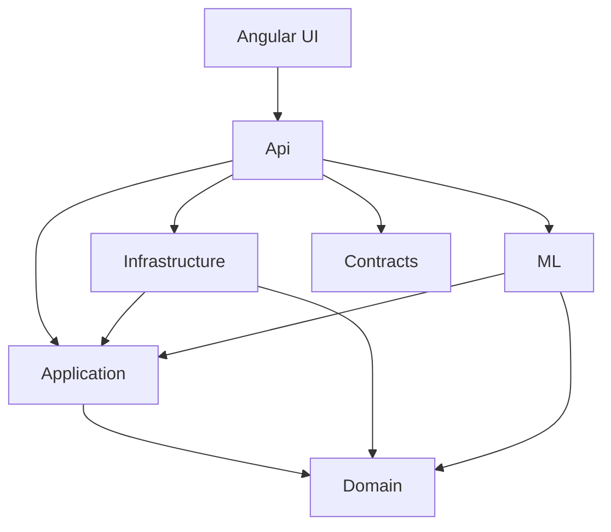

# Clean Architecture

Phase 1 establishes the compile-time dependency graph. Later phases fill in adapters; they must not invert this graph.

## Layers

### Domain

Enterprise/clinical concepts: Patient, Observation, Encounter, and domain errors.

No NuGet packages, no EF attributes, no FHIR resource types, no ML.NET types.

### Application

Use cases, validators, DTOs, and abstractions (`IClock`, later `IPredictionService`, message publishers, blob stores).

Depends only on Domain. This is where the diagnostic workflow will live:

Doctor request → validate → load patient and observations → feature-engineer → predict → persist → outbox.

### Infrastructure

EF Core, SQL, Redis, Service Bus, Blob Storage, FHIR mapping.

Implements Application interfaces. If Redis is down, callers still have a SQL path (Phase 10). If Service Bus is down, the outbox still has the row (Phase 9).

### ML

ML.NET + LightGBM training, evaluation, model loading, and prediction.

Consumes a clean feature model, not FHIR `Observation` classes. Training code is isolated so the API never constructs a training pipeline per HTTP request.

### Contracts

Versioned HTTP request/response shapes. Independent of Domain so persistence changes do not break clients.

### Api

Composition root: `AddApplication`, `AddInfrastructure`, `AddMachineLearning`, `AddApiServices`.

Controllers depend on Application abstractions and Contracts. They do not reference Domain entities.

## What is intentionally not abstracted

EF Core already provides unit of work and change tracking. Phase 2 will use `DbContext` directly unless an abstraction provides a real seam (for example wrapping a third-party FHIR client or a Service Bus sender).

## Composition root

`Program.cs` is the only place that references Infrastructure and ML implementations. Tests use `WebApplicationFactory<Program>` against this root.

## Configuration

`DiagnosticsPlatformOptions` uses the Options pattern with data annotations and `ValidateOnStart()`. A missing section fails process startup, which is the correct behavior for a clinical API.

## Time

`IClock` is the first Application abstraction because audit timestamps, observation `ObservedAt` comparisons, and model `TrainingDate` must be testable without `DateTimeOffset.UtcNow`.
